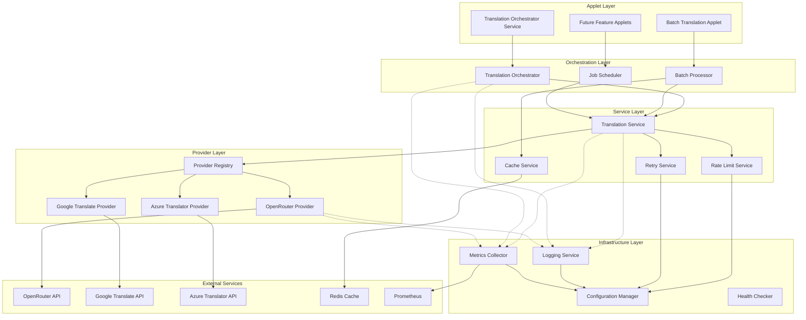

# AI Translation Project - Refactored Architecture Plan

## 1. Current Issues

### **Architecture Problems Identified**

#### **Tight Coupling & Poor Separation**
- **Service initialization complexity**: `ServiceInitializer` creates a complex dependency graph with manual initialization order
- **Hardcoded dependencies**: Direct imports create tight coupling between translation_core and all service layers
- **Mixed responsibilities**: `TranslationCore` handles both business logic and service orchestration
- **Configuration scattered**: Multiple config loading mechanisms (`ConfigurationLoader`, direct JSON loading in services)

#### **Lack of Extensibility**
- **Provider lock-in**: OpenRouter client is hardcoded - no abstraction for other translation providers  
- **No plugin architecture**: Adding new translation engines requires code modification across multiple files
- **Inflexible configuration**: JSON-only config with hardcoded file paths and no environment-based overrides

#### **Observability Gaps**
- **Basic logging only**: Simple file-based logging without structured data or centralized collection
- **No metrics/monitoring**: Missing performance metrics, success rates, and operational dashboards
- **Poor error tracking**: Generic exception handling without categorization or detailed context

#### **Testing & Reliability Issues**
- **Limited fault tolerance**: Basic retry logic without circuit breaker patterns
- **Minimal testing infrastructure**: Only basic pytest setup, no integration test framework
- **No graceful degradation**: System fails completely if primary provider is unavailable

#### **Performance Limitations**
- **Simplistic concurrency**: Basic semaphore without adaptive load balancing
- **No caching layer**: Repeated translation requests hit external APIs unnecessarily
- **Blocking initialization**: Synchronous service setup blocks application startup

---

## 2. Proposed Refactored Architecture

### **Core Design Principles**
1. **Simplicity First**: Minimize complexity while meeting extensibility goals
2. **Clean Interfaces**: Well-defined contracts between layers
3. **Configuration-Driven**: All behavior controlled through config, zero hardcoded values
4. **Provider Agnostic**: Support multiple translation engines through simple adapter pattern
5. **Observable by Default**: Built-in metrics and logging without external dependencies

### **Layered Architecture**

```
┌─────────────────────────────────────────────────────┐
│                  APPLET LAYER                       │ ← Feature modules (no inter-dependencies)
├─────────────────────────────────────────────────────┤
│               ORCHESTRATION LAYER                   │ ← Business logic coordination  
├─────────────────────────────────────────────────────┤
│                 SERVICE LAYER                       │ ← Core translation services
├─────────────────────────────────────────────────────┤
│                PROVIDER LAYER                       │ ← External service adapters
├─────────────────────────────────────────────────────┤
│              INFRASTRUCTURE LAYER                   │ ← Config, logging, metrics
└─────────────────────────────────────────────────────┘
```

### **Key Components**

#### **Infrastructure Layer**
- **`ConfigurationManager`**: Unified YAML/JSON config with environment variable support
- **`LoggingService`**: Structured JSON logging with configurable outputs  
- **`MetricsCollector`**: Lightweight metrics collection (counters, histograms, gauges)
- **`HealthChecker`**: Simple health check endpoints for monitoring

#### **Provider Layer** 
- **`TranslationProvider`** (Interface): Simple contract for translation services
- **`OpenRouterProvider`**: Current OpenRouter implementation 
- **`GoogleTranslateProvider`**: Google Translate adapter (future)
- **`ProviderRegistry`**: Dynamic provider discovery and instantiation

#### **Service Layer**
- **`TranslationService`**: Core translation business logic
- **`CacheService`**: Optional translation result caching
- **`RateLimitService`**: Provider-agnostic rate limiting
- **`RetryService`**: Configurable retry with exponential backoff

#### **Orchestration Layer**
- **`TranslationOrchestrator`**: Coordinates multiple services for complex workflows
- **`BatchProcessor`**: Handles concurrent batch operations with monitoring
- **`JobScheduler`**: Queue-based job processing for large workloads

#### **Applet Layer** 
- **Feature-specific modules**: Each applet remains independent with no cross-dependencies
- **Clean service consumption**: Use dependency injection to access lower layers

---

## 3. Migration Roadmap

### **Phase 1: Foundation (Weeks 1-2)**
**Goal**: Establish infrastructure without breaking existing functionality

1. **Create Infrastructure Layer**
   - Implement `ConfigurationManager` with backward compatibility
   - Set up `LoggingService` with structured output
   - Add basic `MetricsCollector` 

2. **Introduce Provider Interface**
   - Define `TranslationProvider` contract
   - Wrap existing OpenRouter logic in provider implementation
   - Update existing code to use provider interface

3. **Dependency Injection Setup**
   - Replace `ServiceInitializer` with simple DI container
   - Maintain existing public API contracts

### **Phase 2: Service Refactoring (Weeks 3-4)**
**Goal**: Clean separation of concerns in service layer

1. **Extract Core Services**
   - Split `TranslationCore` into focused services
   - Implement `RateLimitService` and `RetryService`
   - Add optional `CacheService`

2. **Update Orchestration**
   - Refactor `BatchProcessor` to use new service layer
   - Implement improved error handling and monitoring
   - Add configurable concurrency controls

3. **Backward Compatibility**
   - Maintain existing applet interfaces
   - Provide migration path for configuration files

### **Phase 3: Enhanced Features (Weeks 5-6)**  
**Goal**: Add production-ready features and extensibility

1. **Provider Ecosystem**
   - Implement additional translation providers
   - Add runtime provider selection
   - Provider health checking and failover

2. **Observability**
   - Integrate OpenTelemetry for tracing
   - Add Prometheus metrics export
   - Create monitoring dashboards

3. **Testing & Reliability**
   - Comprehensive integration test suite
   - Circuit breaker implementation
   - Graceful degradation scenarios

---

## 4. Architecture Diagram



---

## 5. Technology/Tooling Suggestions

### **Core Framework**
- **Dependency Injection**: `dependency-injector` (lightweight, simple configuration)
- **Configuration**: `pydantic-settings` (validation + environment variable support)
- **Async Framework**: Continue with `asyncio` + `aiohttp` (already working well)

### **Observability Stack**
- **Structured Logging**: `structlog` (JSON output, contextual logging)
- **Metrics**: `prometheus-client` (industry standard, simple integration)
- **Tracing**: `opentelemetry-api` + `opentelemetry-sdk` (vendor-neutral)
- **Health Checks**: Simple HTTP endpoints using `aiohttp`

### **Testing & Quality**
- **Unit Tests**: Continue with `pytest` + `pytest-asyncio`
- **Integration Tests**: `pytest-docker` for external service testing
- **Coverage**: `pytest-cov` with stricter thresholds (>85%)
- **Type Checking**: `mypy` for static analysis

### **Configuration & Deployment**
- **Config Format**: YAML with JSON fallback (better readability)
- **Environment Variables**: Support for all config overrides
- **Container**: Simple `Dockerfile` with multi-stage builds
- **Orchestration**: Docker Compose for local development

### **Performance & Reliability**
- **Caching**: `redis` for distributed caching (optional)
- **Rate Limiting**: `aiohttp-limiter` for request throttling
- **Circuit Breaker**: `aiobreaker` for fault tolerance
- **Load Balancing**: Simple round-robin in provider registry

---

## 6. Expected Outcomes & Benefits

### **Immediate Benefits (Phase 1)**
- **Cleaner Configuration**: Single source of truth for all settings
- **Better Logging**: Structured logs make debugging significantly easier
- **Basic Metrics**: Understanding of system performance and bottlenecks

### **Medium-term Benefits (Phase 2-3)**
- **Provider Flexibility**: Easy addition of new translation services
- **Improved Reliability**: Better error handling and retry mechanisms
- **Performance Monitoring**: Real-time visibility into system health

### **Long-term Benefits**
- **Reduced Maintenance**: Clean architecture reduces technical debt
- **Faster Feature Development**: New applets can focus on business logic
- **Production Readiness**: Comprehensive monitoring and alerting capabilities

### **Metrics for Success**
- **Code Quality**: Reduced cyclomatic complexity, improved test coverage (>85%)
- **Performance**: 20% improvement in batch processing throughput
- **Reliability**: 99.5% uptime with proper fallback mechanisms
- **Developer Experience**: 50% reduction in time to add new translation providers

### **Risk Mitigation**
- **Backward Compatibility**: Existing applets continue working during migration
- **Incremental Rollout**: Phase-based implementation reduces deployment risk
- **Simple Design**: Avoid over-engineering - each abstraction must provide clear value
- **Comprehensive Testing**: Integration tests ensure provider switching works correctly

---

**Architecture Philosophy**: "Make it work, make it right, make it fast" - prioritizing correctness and maintainability over premature optimization, while ensuring the foundation supports future scaling needs.