# AI Translation Architecture - Class Diagram & Interfaces

## 1. Comprehensive Class Diagram

```mermaid
classDiagram
    %% ===== CONFIGURATION LAYER =====
    class IConfigurationManager {
        <<interface>>
        +get_config(key: str) Any
        +get_section(section: str) Dict
        +reload_config() void
        +validate_config() bool
    }

    class ConfigurationManager {
        -config_data: Dict
        -env_vars: Dict
        -validators: List[Validator]
        +get_config(key: str) Any
        +get_section(section: str) Dict
        +reload_config() void
        +validate_config() bool
        +register_validator(validator: Validator) void
    }

    %% ===== APPLET LAYER =====
    class ITranslationApplet {
        <<interface>>
        +execute(params: Dict) AppletResult
        +get_name() str
        +get_version() str
        +validate_params(params: Dict) bool
    }

    class TranslationOrchestratorApplet {
        -translation_manager: ITranslationManager
        +execute(params: Dict) AppletResult
        +get_name() str
        +get_version() str
        +validate_params(params: Dict) bool
    }

    class BatchTranslationApplet {
        -translation_manager: ITranslationManager
        -job_scheduler: IJobScheduler
        +execute(params: Dict) AppletResult
        +get_name() str
        +get_version() str
        +validate_params(params: Dict) bool
    }

    %% ===== MIDDLEWARE LAYER =====
    class ITranslationManager {
        <<interface>>
        +translate_single(request: TranslationRequest) TranslationResult
        +translate_batch(requests: List[TranslationRequest]) BatchResult
        +get_status() ManagerStatus
        +shutdown() void
    }

    class TranslationManager {
        -request_manager: IRequestManager
        -job_scheduler: IJobScheduler
        -resiliency_manager: IResiliencyManager
        -metrics: IMetricsCollector
        +translate_single(request: TranslationRequest) TranslationResult
        +translate_batch(requests: List[TranslationRequest]) BatchResult
        +get_status() ManagerStatus
        +shutdown() void
    }

    class IJobScheduler {
        <<interface>>
        +schedule_job(job: TranslationJob) JobId
        +cancel_job(job_id: JobId) bool
        +get_job_status(job_id: JobId) JobStatus
        +list_jobs(filter: JobFilter) List[JobStatus]
    }

    class JobScheduler {
        -job_queue: Queue[TranslationJob]
        -active_jobs: Dict[JobId, JobHandle]
        -executor: ThreadPoolExecutor
        +schedule_job(job: TranslationJob) JobId
        +cancel_job(job_id: JobId) bool
        +get_job_status(job_id: JobId) JobStatus
        +list_jobs(filter: JobFilter) List[JobStatus]
    }

    class IRequestManager {
        <<interface>>
        +process_request(request: TranslationRequest) ProcessingResult
        +validate_request(request: TranslationRequest) ValidationResult
        +transform_request(request: TranslationRequest) TransformedRequest
    }

    class RequestManager {
        -cache_service: ICacheService
        -standardizer_service: IStandardizerService
        -validator_service: IValidatorService
        +process_request(request: TranslationRequest) ProcessingResult
        +validate_request(request: TranslationRequest) ValidationResult
        +transform_request(request: TranslationRequest) TransformedRequest
    }

    class IResiliencyManager {
        <<interface>>
        +configure_policy(policy: ResiliencyPolicy) void
        +get_fault_handler() IFaultHandler
        +update_health_status(provider: str, status: HealthStatus) void
        +get_provider_health() Dict[str, HealthStatus]
    }

    class ResiliencyManager {
        -fault_handler: IFaultHandler
        -health_monitor: IHealthMonitor
        -policies: Dict[str, ResiliencyPolicy]
        +configure_policy(policy: ResiliencyPolicy) void
        +get_fault_handler() IFaultHandler
        +update_health_status(provider: str, status: HealthStatus) void
        +get_provider_health() Dict[str, HealthStatus]
    }

    %% ===== SERVICE LAYER =====
    class IKeyService {
        <<interface>>
        +get_next_key(provider: str) Optional[ApiKey]
        +report_key_error(key: str, error: ErrorType) void
        +get_key_status(key: str) KeyStatus
        +rotate_keys() void
    }

    class KeyService {
        -key_pools: Dict[str, List[ApiKey]]
        -key_health: Dict[str, KeyHealth]
        -rotation_policy: RotationPolicy
        +get_next_key(provider: str) Optional[ApiKey]
        +report_key_error(key: str, error: ErrorType) void
        +get_key_status(key: str) KeyStatus
        +rotate_keys() void
    }

    class ICacheService {
        <<interface>>
        +get(key: str) Optional[Any]
        +set(key: str, value: Any, ttl: int) void
        +delete(key: str) bool
        +clear() void
    }

    class CacheService {
        -cache_backend: ICacheBackend
        -serializer: ISerializer
        +get(key: str) Optional[Any]
        +set(key: str, value: Any, ttl: int) void
        +delete(key: str) bool
        +clear() void
    }

    class IStandardizerService {
        <<interface>>
        +register_standardizer(format_type: str, standardizer: IStandardizer) void
        +standardize(content: Any, format_type: str) StandardizedContent
        +get_supported_formats() List[str]
        +detect_format(content: Any) str
    }

    class StandardizerService {
        -standardizers: Dict[str, IStandardizer]
        -format_detector: IFormatDetector
        +register_standardizer(format_type: str, standardizer: IStandardizer) void
        +standardize(content: Any, format_type: str) StandardizedContent
        +get_supported_formats() List[str]
        +detect_format(content: Any) str
    }

    class IStandardizer {
        <<interface>>
        +standardize(content: Any) StandardizedContent
        +validate(content: Any) bool
        +get_format_type() str
        +get_schema() Dict
    }

    class RenpyStandardizer {
        -tag_parser: TagParser
        -dialogue_extractor: DialogueExtractor
        +standardize(content: Any) StandardizedContent
        +validate(content: Any) bool
        +get_format_type() str
        +get_schema() Dict
    }

    class IValidatorService {
        <<interface>>
        +validate(data: Any, schema: ValidationSchema) ValidationResult
        +register_validator(name: str, validator: IValidator) void
        +get_validators() List[str]
    }

    class ValidatorService {
        -validators: Dict[str, IValidator]
        -schema_registry: SchemaRegistry
        +validate(data: Any, schema: ValidationSchema) ValidationResult
        +register_validator(name: str, validator: IValidator) void
        +get_validators() List[str]
    }

    class IHealthMonitor {
        <<interface>>
        +check_health(provider: str) HealthStatus
        +register_health_check(provider: str, checker: IHealthChecker) void
        +get_all_health() Dict[str, HealthStatus]
        +start_monitoring() void
        +stop_monitoring() void
    }

    class HealthMonitor {
        -health_checkers: Dict[str, IHealthChecker]
        -health_cache: Dict[str, HealthStatus]
        -monitoring_scheduler: Scheduler
        +check_health(provider: str) HealthStatus
        +register_health_check(provider: str, checker: IHealthChecker) void
        +get_all_health() Dict[str, HealthStatus]
        +start_monitoring() void
        +stop_monitoring() void
    }

    class IFaultHandler {
        <<interface>>
        +handle_fault(error: Exception, context: FaultContext) FaultResult
        +configure_retry(policy: RetryPolicy) void
        +configure_circuit_breaker(policy: CircuitBreakerPolicy) void
        +get_fault_stats() FaultStatistics
    }

    class UnifiedFaultHandler {
        -retry_handler: IRetryHandler
        -circuit_breaker: ICircuitBreaker
        -timeout_handler: ITimeoutHandler
        -fault_logger: ILogger
        +handle_fault(error: Exception, context: FaultContext) FaultResult
        +configure_retry(policy: RetryPolicy) void
        +configure_circuit_breaker(policy: CircuitBreakerPolicy) void
        +get_fault_stats() FaultStatistics
    }

    class IProviderOrchestrator {
        <<interface>>
        +select_provider(request: TranslationRequest) str
        +execute_translation(request: TranslationRequest) TranslationResult
        +register_provider(name: str, provider: ITranslationProvider) void
        +get_provider_status() Dict[str, ProviderStatus]
    }

    class ProviderOrchestrator {
        -providers: Dict[str, ITranslationProvider]
        -load_balancer: ILoadBalancer
        -health_monitor: IHealthMonitor
        +select_provider(request: TranslationRequest) str
        +execute_translation(request: TranslationRequest) TranslationResult
        +register_provider(name: str, provider: ITranslationProvider) void
        +get_provider_status() Dict[str, ProviderStatus]
    }

    class ITranslationProvider {
        <<interface>>
        +translate(request: TranslationRequest) TranslationResult
        +get_name() str
        +get_capabilities() ProviderCapabilities
        +health_check() HealthStatus
        +get_rate_limits() RateLimits
    }

    class ResilientTranslationProvider {
        -base_provider: ITranslationProvider
        -fault_handler: IFaultHandler
        -metrics: IMetricsCollector
        +translate(request: TranslationRequest) TranslationResult
        +get_name() str
        +get_capabilities() ProviderCapabilities
        +health_check() HealthStatus
        +get_rate_limits() RateLimits
    }

    class OpenRouterProvider {
        -client: OpenRouterClient
        -key_service: IKeyService
        +translate(request: TranslationRequest) TranslationResult
        +get_name() str
        +get_capabilities() ProviderCapabilities
        +health_check() HealthStatus
        +get_rate_limits() RateLimits
    }

    %% ===== OBSERVABILITY LAYER =====
    class IMetricsCollector {
        <<interface>>
        +increment_counter(name: str, value: int, tags: Dict) void
        +record_histogram(name: str, value: float, tags: Dict) void
        +set_gauge(name: str, value: float, tags: Dict) void
        +get_metrics() MetricsSnapshot
    }

    class MetricsCollector {
        -metrics_backend: IMetricsBackend
        -metric_registry: MetricRegistry
        +increment_counter(name: str, value: int, tags: Dict) void
        +record_histogram(name: str, value: float, tags: Dict) void
        +set_gauge(name: str, value: float, tags: Dict) void
        +get_metrics() MetricsSnapshot
    }

    class ILogger {
        <<interface>>
        +debug(message: str, context: Dict) void
        +info(message: str, context: Dict) void
        +warning(message: str, context: Dict) void
        +error(message: str, context: Dict) void
        +critical(message: str, context: Dict) void
    }

    class StructuredLogger {
        -formatter: ILogFormatter
        -handlers: List[ILogHandler]
        +debug(message: str, context: Dict) void
        +info(message: str, context: Dict) void
        +warning(message: str, context: Dict) void
        +error(message: str, context: Dict) void
        +critical(message: str, context: Dict) void
    }

    %% ===== DATA MODELS =====
    class TranslationRequest {
        +content: Any
        +source_language: str
        +target_language: str
        +format_type: str
        +metadata: Dict
        +options: TranslationOptions
    }

    class TranslationResult {
        +translated_content: Any
        +original_content: Any
        +source_language: str
        +target_language: str
        +provider_name: str
        +metadata: Dict
        +metrics: TranslationMetrics
    }

    class TranslationJob {
        +id: JobId
        +request: TranslationRequest
        +priority: int
        +created_at: datetime
        +scheduled_at: datetime
        +callback: Optional[Callable]
    }

    class HealthStatus {
        +is_healthy: bool
        +status_code: int
        +message: str
        +last_check: datetime
        +response_time: float
    }

    class ResiliencyPolicy {
        +retry_policy: RetryPolicy
        +circuit_breaker_policy: CircuitBreakerPolicy
        +timeout_policy: TimeoutPolicy
        +bulkhead_policy: BulkheadPolicy
    }

    %% ===== RELATIONSHIPS =====
    IConfigurationManager <|.. ConfigurationManager
    ITranslationApplet <|.. TranslationOrchestratorApplet
    ITranslationApplet <|.. BatchTranslationApplet
    ITranslationManager <|.. TranslationManager
    IJobScheduler <|.. JobScheduler
    IRequestManager <|.. RequestManager
    IResiliencyManager <|.. ResiliencyManager
    IKeyService <|.. KeyService
    ICacheService <|.. CacheService
    IStandardizerService <|.. StandardizerService
    IStandardizer <|.. RenpyStandardizer
    IValidatorService <|.. ValidatorService
    IHealthMonitor <|.. HealthMonitor
    IFaultHandler <|.. UnifiedFaultHandler
    IProviderOrchestrator <|.. ProviderOrchestrator
    ITranslationProvider <|.. ResilientTranslationProvider
    ITranslationProvider <|.. OpenRouterProvider
    IMetricsCollector <|.. MetricsCollector
    ILogger <|.. StructuredLogger

    TranslationManager --> IRequestManager
    TranslationManager --> IJobScheduler
    TranslationManager --> IResiliencyManager
    RequestManager --> ICacheService
    RequestManager --> IStandardizerService
    RequestManager --> IValidatorService
    ResiliencyManager --> IFaultHandler
    ResiliencyManager --> IHealthMonitor
    StandardizerService --> IStandardizer
    ProviderOrchestrator --> ITranslationProvider
    ProviderOrchestrator --> IHealthMonitor
    ResilientTranslationProvider --> ITranslationProvider
    ResilientTranslationProvider --> IFaultHandler
    OpenRouterProvider --> IKeyService
    TranslationOrchestratorApplet --> ITranslationManager
    BatchTranslationApplet --> ITranslationManager
    BatchTranslationApplet --> IJobScheduler
```



## 2. Core Interfaces Specifications

### 2.1. Configuration Layer Interfaces

```python
from abc import ABC, abstractmethod
from typing import Any, Dict, Optional, List

class IConfigurationManager(ABC):
    """Central configuration management interface"""
    
    @abstractmethod
    def get_config(self, key: str, default: Any = None) -> Any:
        """Get configuration value by key"""
        pass
    
    @abstractmethod
    def get_section(self, section: str) -> Dict[str, Any]:
        """Get entire configuration section"""
        pass
    
    @abstractmethod
    def reload_config(self) -> None:
        """Reload configuration from source"""
        pass
    
    @abstractmethod
    def validate_config(self) -> bool:
        """Validate current configuration"""
        pass
    
    @abstractmethod
    def register_validator(self, validator: 'IConfigValidator') -> None:
        """Register configuration validator"""
        pass

class IConfigValidator(ABC):
    """Interface for configuration validators"""
    
    @abstractmethod
    def validate(self, config: Dict[str, Any]) -> ValidationResult:
        """Validate configuration section"""
        pass
```

### 2.2. Applet Layer Interfaces

```python
class ITranslationApplet(ABC):
    """Base interface for all translation applets"""
    
    @abstractmethod
    async def execute(self, params: Dict[str, Any]) -> 'AppletResult':
        """Execute applet with given parameters"""
        pass
    
    @abstractmethod
    def get_name(self) -> str:
        """Get applet name"""
        pass
    
    @abstractmethod
    def get_version(self) -> str:
        """Get applet version"""
        pass
    
    @abstractmethod
    def validate_params(self, params: Dict[str, Any]) -> bool:
        """Validate input parameters"""
        pass
    
    @abstractmethod
    def get_capabilities(self) -> 'AppletCapabilities':
        """Get applet capabilities"""
        pass
```

### 2.3. Middleware Layer Interfaces

```python
class ITranslationManager(ABC):
    """Main translation orchestration interface"""
    
    @abstractmethod
    async def translate_single(self, request: 'TranslationRequest') -> 'TranslationResult':
        """Translate single content item"""
        pass
    
    @abstractmethod
    async def translate_batch(self, requests: List['TranslationRequest']) -> 'BatchResult':
        """Translate multiple content items"""
        pass
    
    @abstractmethod
    def get_status(self) -> 'ManagerStatus':
        """Get current manager status"""
        pass
    
    @abstractmethod
    async def shutdown(self) -> None:
        """Gracefully shutdown manager"""
        pass

class IJobScheduler(ABC):
    """Job scheduling and management interface"""
    
    @abstractmethod
    async def schedule_job(self, job: 'TranslationJob') -> 'JobId':
        """Schedule a translation job"""
        pass
    
    @abstractmethod
    async def cancel_job(self, job_id: 'JobId') -> bool:
        """Cancel scheduled job"""
        pass
    
    @abstractmethod
    def get_job_status(self, job_id: 'JobId') -> 'JobStatus':
        """Get job status"""
        pass
    
    @abstractmethod
    def list_jobs(self, filter: 'JobFilter' = None) -> List['JobStatus']:
        """List jobs with optional filter"""
        pass

class IRequestManager(ABC):
    """Request processing pipeline interface"""
    
    @abstractmethod
    async def process_request(self, request: 'TranslationRequest') -> 'ProcessingResult':
        """Process translation request through pipeline"""
        pass
    
    @abstractmethod
    def validate_request(self, request: 'TranslationRequest') -> 'ValidationResult':
        """Validate incoming request"""
        pass
    
    @abstractmethod
    async def transform_request(self, request: 'TranslationRequest') -> 'TransformedRequest':
        """Transform request for provider consumption"""
        pass

class IResiliencyManager(ABC):
    """Resiliency and fault tolerance management"""
    
    @abstractmethod
    def configure_policy(self, provider: str, policy: 'ResiliencyPolicy') -> None:
        """Configure resiliency policy for provider"""
        pass
    
    @abstractmethod
    def get_fault_handler(self) -> 'IFaultHandler':
        """Get configured fault handler"""
        pass
    
    @abstractmethod
    def update_health_status(self, provider: str, status: 'HealthStatus') -> None:
        """Update provider health status"""
        pass
    
    @abstractmethod
    def get_provider_health(self) -> Dict[str, 'HealthStatus']:
        """Get all provider health statuses"""
        pass
```

### 2.4. Service Layer Interfaces

```python
class IStandardizerService(ABC):
    """Content standardization service interface"""
    
    @abstractmethod
    def register_standardizer(self, format_type: str, standardizer: 'IStandardizer') -> None:
        """Register standardizer for specific format"""
        pass
    
    @abstractmethod
    async def standardize(self, content: Any, format_type: str) -> 'StandardizedContent':
        """Standardize content to common format"""
        pass
    
    @abstractmethod
    def get_supported_formats(self) -> List[str]:
        """Get list of supported formats"""
        pass
    
    @abstractmethod
    def detect_format(self, content: Any) -> Optional[str]:
        """Auto-detect content format"""
        pass

class IStandardizer(ABC):
    """Individual format standardizer interface"""
    
    @abstractmethod
    async def standardize(self, content: Any) -> 'StandardizedContent':
        """Standardize content"""
        pass
    
    @abstractmethod
    def validate(self, content: Any) -> bool:
        """Validate content format"""
        pass
    
    @abstractmethod
    def get_format_type(self) -> str:
        """Get supported format type"""
        pass
    
    @abstractmethod
    def get_schema(self) -> Dict[str, Any]:
        """Get content schema definition"""
        pass

class ITranslationProvider(ABC):
    """Translation provider interface"""
    
    @abstractmethod
    async def translate(self, request: 'TranslationRequest') -> 'TranslationResult':
        """Perform translation"""
        pass
    
    @abstractmethod
    def get_name(self) -> str:
        """Get provider name"""
        pass
    
    @abstractmethod
    def get_capabilities(self) -> 'ProviderCapabilities':
        """Get provider capabilities"""
        pass
    
    @abstractmethod
    async def health_check(self) -> 'HealthStatus':
        """Check provider health"""
        pass
    
    @abstractmethod
    def get_rate_limits(self) -> 'RateLimits':
        """Get provider rate limits"""
        pass

class IProviderOrchestrator(ABC):
    """Provider selection and orchestration interface"""
    
    @abstractmethod
    def select_provider(self, request: 'TranslationRequest') -> str:
        """Select best provider for request"""
        pass
    
    @abstractmethod
    async def execute_translation(self, request: 'TranslationRequest') -> 'TranslationResult':
        """Execute translation using selected provider"""
        pass
    
    @abstractmethod
    def register_provider(self, name: str, provider: ITranslationProvider) -> None:
        """Register new translation provider"""
        pass
    
    @abstractmethod
    def get_provider_status(self) -> Dict[str, 'ProviderStatus']:
        """Get status of all providers"""
        pass

class IKeyService(ABC):
    """API key management interface"""
    
    @abstractmethod
    async def get_next_key(self, provider: str) -> Optional['ApiKey']:
        """Get next available API key"""
        pass
    
    @abstractmethod
    async def report_key_error(self, key: str, error: 'ErrorType') -> None:
        """Report API key error"""
        pass
    
    @abstractmethod
    def get_key_status(self, key: str) -> 'KeyStatus':
        """Get API key status"""
        pass
    
    @abstractmethod
    async def rotate_keys(self) -> None:
        """Rotate API keys"""
        pass

class ICacheService(ABC):
    """Caching service interface"""
    
    @abstractmethod
    async def get(self, key: str) -> Optional[Any]:
        """Get cached value"""
        pass
    
    @abstractmethod
    async def set(self, key: str, value: Any, ttl: int = None) -> None:
        """Set cached value"""
        pass
    
    @abstractmethod
    async def delete(self, key: str) -> bool:
        """Delete cached value"""
        pass
    
    @abstractmethod
    async def clear(self) -> None:
        """Clear all cached values"""
        pass

class IHealthMonitor(ABC):
    """Health monitoring interface"""
    
    @abstractmethod
    async def check_health(self, provider: str) -> 'HealthStatus':
        """Check provider health"""
        pass
    
    @abstractmethod
    def register_health_check(self, provider: str, checker: 'IHealthChecker') -> None:
        """Register health check for provider"""
        pass
    
    @abstractmethod
    def get_all_health(self) -> Dict[str, 'HealthStatus']:
        """Get all provider health statuses"""
        pass
    
    @abstractmethod
    async def start_monitoring(self) -> None:
        """Start health monitoring"""
        pass
    
    @abstractmethod
    async def stop_monitoring(self) -> None:
        """Stop health monitoring"""
        pass

class IFaultHandler(ABC):
    """Fault handling interface"""
    
    @abstractmethod
    async def handle_fault(self, error: Exception, context: 'FaultContext') -> 'FaultResult':
        """Handle fault with configured policies"""
        pass
    
    @abstractmethod
    def configure_retry(self, policy: 'RetryPolicy') -> None:
        """Configure retry policy"""
        pass
    
    @abstractmethod
    def configure_circuit_breaker(self, policy: 'CircuitBreakerPolicy') -> None:
        """Configure circuit breaker policy"""
        pass
    
    @abstractmethod
    def get_fault_stats(self) -> 'FaultStatistics':
        """Get fault handling statistics"""
        pass
```

### 2.5. Observability Interfaces

```python
class IMetricsCollector(ABC):
    """Metrics collection interface"""
    
    @abstractmethod
    def increment_counter(self, name: str, value: int = 1, tags: Dict[str, str] = None) -> None:
        """Increment counter metric"""
        pass
    
    @abstractmethod
    def record_histogram(self, name: str, value: float, tags: Dict[str, str] = None) -> None:
        """Record histogram metric"""
        pass
    
    @abstractmethod
    def set_gauge(self, name: str, value: float, tags: Dict[str, str] = None) -> None:
        """Set gauge metric"""
        pass
    
    @abstractmethod
    def get_metrics(self) -> 'MetricsSnapshot':
        """Get current metrics snapshot"""
        pass

class ILogger(ABC):
    """Structured logging interface"""
    
    @abstractmethod
    def debug(self, message: str, context: Dict[str, Any] = None) -> None:
        """Log debug message"""
        pass
    
    @abstractmethod
    def info(self, message: str, context: Dict[str, Any] = None) -> None:
        """Log info message"""
        pass
    
    @abstractmethod
    def warning(self, message: str, context: Dict[str, Any] = None) -> None:
        """Log warning message"""
        pass
    
    @abstractmethod
    def error(self, message: str, context: Dict[str, Any] = None) -> None:
        """Log error message"""
        pass
    
    @abstractmethod
    def critical(self, message: str, context: Dict[str, Any] = None) -> None:
        """Log critical message"""
        pass

class ITraceManager(ABC):
    """Distributed tracing interface"""
    
    @abstractmethod
    def start_span(self, name: str, parent_span: 'Span' = None) -> 'Span':
        """Start new trace span"""
        pass
    
    @abstractmethod
    def finish_span(self, span: 'Span') -> None:
        """Finish trace span"""
        pass
    
    @abstractmethod
    def add_span_tag(self, span: 'Span', key: str, value: Any) -> None:
        """Add tag to span"""
        pass
    
    @abstractmethod
    def get_current_span(self) -> Optional['Span']:
        """Get current active span"""
        pass
```

## 3. Key Data Models

```python
from dataclasses import dataclass
from datetime import datetime
from typing import Any, Dict, List, Optional, Union
from enum import Enum

@dataclass
class TranslationRequest:
    content: Any
    source_language: str
    target_language: str
    format_type: str
    metadata: Dict[str, Any] = None
    options: 'TranslationOptions' = None
    request_id: str = None
    created_at: datetime = None

@dataclass
class TranslationResult:
    translated_content: Any
    original_content: Any
    source_language: str
    target_language: str
    provider_name: str
    metadata: Dict[str, Any] = None
    metrics: 'TranslationMetrics' = None
    request_id: str = None
    completed_at: datetime = None

@dataclass
class StandardizedContent:
    content: Dict[str, Any]
    format_type: str
    schema_version: str
    metadata: Dict[str, Any] = None

@dataclass
class HealthStatus:
    is_healthy: bool
    status_code: int
    message: str
    last_check: datetime
    response_time: float
    details: Dict[str, Any] = None

@dataclass
class ResiliencyPolicy:
    retry_policy: 'RetryPolicy'
    circuit_breaker_policy: 'CircuitBreakerPolicy'
    timeout_policy: 'TimeoutPolicy'
    bulkhead_policy: 'BulkheadPolicy' = None

class ErrorType(Enum):
    RATE_LIMIT = "rate_limit"
    AUTH_ERROR = "auth_error"
    NETWORK_ERROR = "network_error"
    SERVER_ERROR = "server_error"
    TIMEOUT = "timeout"
    UNKNOWN = "unknown"

class JobStatus(Enum):
    PENDING = "pending"
    RUNNING = "running"
    COMPLETED = "completed"
    FAILED = "failed"
    CANCELLED = "cancelled"
```

## 4. Implementation Guidelines

### 4.1. Interface Implementation Priority

**Phase 1 - Core Interfaces:**
1. `IConfigurationManager` - Foundation for all other services
2. `ITranslationProvider` - Basic translation capability
3. `ITranslationManager` - Core orchestration
4. `ILogger` - Basic observability

**Phase 2 - Enhanced Features:**
1. `IStandardizerService` + `IStandardizer` - Content processing
2. `IKeyService` - API key management
3. `IHealthMonitor` - Provider health tracking
4. `ICacheService` - Performance optimization

**Phase 3 - Advanced Features:**
1. `IResiliencyManager` + `IFaultHandler` - Fault tolerance
2. `IJobScheduler` - Advanced scheduling
3. `IMetricsCollector` - Comprehensive metrics
4. `ITraceManager` - Distributed tracing

### 4.2. Key Design Patterns

1. **Factory Pattern**: Provider creation and registration
2. **Strategy Pattern**: Multiple standardizers and providers
3. **Decorator Pattern**: Resilient provider wrappers
4. **Observer Pattern**: Health status notifications
5. **Command Pattern**: Job scheduling and execution

### 4.3. Interface Contract Guidelines

1. **Async by Default**: All I/O operations should be async
2. **Exception Handling**: Specific exceptions for different error types
3. **Type Hints**: Full type annotations for all interface methods
4. **Documentation**: Comprehensive docstrings with examples
5. **Backward Compatibility**: Interface versioning strategy

Các interfaces này cung cấp foundation vững chắc cho architecture, đảm bảo separation of concerns và extensibility. Bạn có muốn tôi detail hơn về implementation của interface nào cụ thể không?