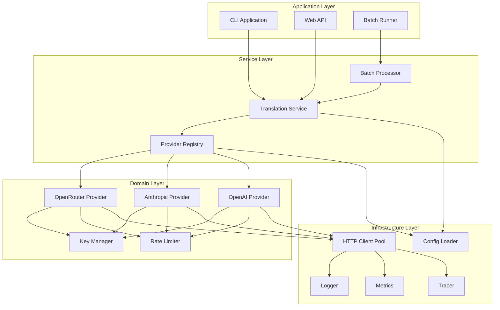
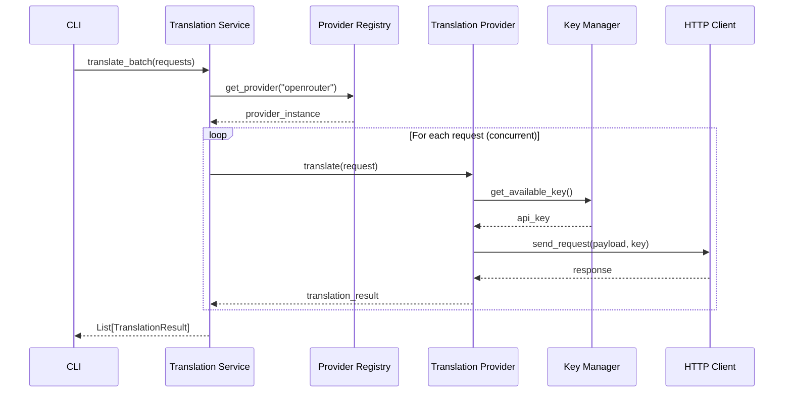

# AI Translation Project - Refactored Architecture Plan

## 1. Current Issues

Based on analysis of the existing codebase, several architectural problems have been identified:

### **Structural Issues**
- **Tight Coupling**: Services are directly instantiated within orchestrators, making testing and swapping difficult
- **Mixed Responsibilities**: Orchestrators handle both workflow coordination AND business logic
- **Duplicate Code**: Multiple orchestrators (`orchestrator.py`, `batch_orchestrator.py`) with overlapping functionality
- **Configuration Scatter**: Config loading logic spread across multiple files with inconsistent patterns

### **Scalability Problems**
- **Hard-coded Dependencies**: API clients, key managers tied to specific implementations
- **Limited Provider Support**: Only OpenRouter client implemented, no abstraction for multiple providers
- **Synchronous Bottlenecks**: Some operations not fully async, limiting concurrent processing
- **Resource Management**: No centralized connection pooling or resource lifecycle management

### **Maintainability Issues**
- **Legacy Code Debt**: Complex legacy modules with over-engineered features (QA, context awareness)
- **Inconsistent Error Handling**: Different error patterns across services
- **Logging Fragmentation**: Multiple logger implementations without unified structure
- **Test Coverage Gaps**: Limited unit test infrastructure

### **Operational Concerns**
- **No Observability**: Missing metrics, tracing, and health checks
- **Configuration Validation**: Weak config validation with poor error messages
- **Deployment Complexity**: No clear separation between environments

## 2. Proposed Refactored Architecture

### **Core Design Principles**
1. **Dependency Inversion**: All components depend on abstractions, not concretions
2. **Single Responsibility**: Each module has one clear purpose
3. **Composition over Inheritance**: Favor flexible composition patterns
4. **Fail-Fast Configuration**: Validate all config at startup
5. **Async-First**: All I/O operations are asynchronous

### **Layered Architecture**

```
┌─────────────────────────────────────────┐
│              Application Layer           │  ← CLI, Web API, Batch Jobs
├─────────────────────────────────────────┤
│               Service Layer              │  ← Translation Service, Orchestration
├─────────────────────────────────────────┤
│               Domain Layer               │  ← Core Translation Logic, Providers
├─────────────────────────────────────────┤
│            Infrastructure Layer          │  ← HTTP Clients, Config, Logging
└─────────────────────────────────────────┘
```

### **Module Structure**

#### **1. Core Domain (`src/core/`)**
```
src/core/
├── models/
│   ├── translation_request.py    # Request/Response models
│   ├── translation_result.py     # Result aggregation
│   └── provider_config.py        # Provider configuration
├── interfaces/
│   ├── translation_provider.py   # Provider abstraction
│   ├── key_manager.py            # Key management interface
│   └── rate_limiter.py           # Rate limiting interface
└── services/
    ├── translation_service.py    # Core translation orchestration
    ├── provider_registry.py      # Provider discovery/selection
    └── batch_processor.py        # Batch processing logic
```

#### **2. Infrastructure (`src/infrastructure/`)**
```
src/infrastructure/
├── providers/
│   ├── openrouter_provider.py    # OpenRouter implementation
│   ├── anthropic_provider.py     # Anthropic implementation
│   └── openai_provider.py        # OpenAI implementation
├── http/
│   ├── async_client.py           # Unified HTTP client with pooling
│   └── retry_handler.py          # Exponential backoff retry logic
├── config/
│   ├── config_loader.py          # YAML/JSON config loading
│   ├── validator.py              # Config validation with Pydantic
│   └── settings.py               # Application settings
└── observability/
    ├── logger.py                 # Structured logging
    ├── metrics.py                # Prometheus metrics
    └── tracer.py                 # OpenTelemetry tracing
```

#### **3. Application (`src/application/`)**
```
src/application/
├── cli/
│   ├── main.py                   # CLI entry point
│   └── commands/                 # CLI command handlers
├── api/
│   ├── fastapi_app.py           # Web API (optional)
│   └── routes/                   # API routes
└── batch/
    ├── batch_runner.py           # Batch job orchestration
    └── job_scheduler.py          # Concurrent job scheduling
```

#### **4. Configuration (`config/`)**
```
config/
├── default.yaml                  # Default configuration
├── development.yaml              # Dev overrides
├── production.yaml               # Prod overrides
└── schema.yaml                   # Config validation schema
```

### **Key Components**

#### **Translation Service (Core)**
```python
class TranslationService:
    def __init__(self, provider_registry: ProviderRegistry, 
                 config: TranslationConfig):
        self.provider_registry = provider_registry
        self.config = config
    
    async def translate_single(self, request: TranslationRequest) -> TranslationResult:
        provider = await self.provider_registry.get_provider(request.provider_name)
        return await provider.translate(request)
    
    async def translate_batch(self, requests: List[TranslationRequest]) -> List[TranslationResult]:
        # Concurrent processing with semaphore control
        semaphore = asyncio.Semaphore(self.config.max_concurrent)
        tasks = [self._translate_with_semaphore(req, semaphore) for req in requests]
        return await asyncio.gather(*tasks, return_exceptions=True)
```

#### **Provider Registry (Plugin System)**
```python
class ProviderRegistry:
    def __init__(self):
        self._providers: Dict[str, TranslationProvider] = {}
    
    def register(self, name: str, provider: TranslationProvider):
        self._providers[name] = provider
    
    async def get_provider(self, name: str) -> TranslationProvider:
        if name not in self._providers:
            raise ProviderNotFoundError(f"Provider '{name}' not registered")
        return self._providers[name]
```

#### **Translation Provider Interface**
```python
class TranslationProvider(ABC):
    @abstractmethod
    async def translate(self, request: TranslationRequest) -> TranslationResult:
        pass
    
    @abstractmethod
    async def health_check(self) -> bool:
        pass
    
    @property
    @abstractmethod
    def name(self) -> str:
        pass
```

## 3. Migration Roadmap

### **Phase 1: Foundation (Week 1-2)**
- [ ] Set up new project structure with proper Python packaging
- [ ] Implement configuration system with Pydantic validation
- [ ] Create core interfaces and models
- [ ] Set up logging and basic observability
- [ ] Implement HTTP client infrastructure

### **Phase 2: Core Services (Week 3-4)**
- [ ] Implement TranslationService with provider registry
- [ ] Create OpenRouter provider implementation
- [ ] Add key management with rotation
- [ ] Implement rate limiting and retry logic
- [ ] Basic unit tests for core components

### **Phase 3: Application Layer (Week 5-6)**
- [ ] Build CLI application with new architecture
- [ ] Implement batch processing functionality
- [ ] Add configuration file examples
- [ ] Integration tests with real providers
- [ ] Performance testing and optimization

### **Phase 4: Migration & Cleanup (Week 7-8)**
- [ ] Migrate existing workflows to new system
- [ ] Add additional providers (Anthropic, OpenAI)
- [ ] Complete observability implementation
- [ ] Documentation and deployment guides
- [ ] Archive legacy modules

### **Integration Strategy**
- **Parallel Development**: Build new architecture alongside existing system
- **Gradual Migration**: Start with CLI, then batch processing
- **Backward Compatibility**: Maintain existing config format during transition
- **Validation**: Side-by-side testing to ensure feature parity

## 4. Architecture Diagram



### **Sequence Diagram: Translation Flow**



## 5. Technology/Tooling Suggestions

### **Core Framework**
- **Python 3.11+**: Latest async features and performance improvements
- **Pydantic v2**: Fast config validation and data modeling
- **aiohttp**: Async HTTP client with connection pooling
- **asyncio**: Native async concurrency control

### **Configuration Management**
- **PyYAML**: YAML configuration files
- **python-dotenv**: Environment variable management
- **Pydantic Settings**: Type-safe configuration with validation

### **Observability Stack**
- **structlog**: Structured JSON logging
- **prometheus-client**: Metrics collection
- **opentelemetry**: Distributed tracing
- **sentry-sdk**: Error tracking and monitoring

### **Development Tools**
- **pytest + pytest-asyncio**: Async testing framework
- **pytest-cov**: Code coverage reporting
- **black + isort**: Code formatting
- **mypy**: Static type checking
- **pre-commit**: Git hooks for quality checks

### **Deployment & CI/CD**
- **Docker**: Containerized deployment
- **GitHub Actions**: CI/CD pipeline
- **dependabot**: Automated dependency updates
- **semantic-release**: Automated versioning

### **Recommended Dependencies**
```toml
[tool.poetry.dependencies]
python = "^3.11"
pydantic = "^2.5.0"
aiohttp = "^3.9.0"
pyyaml = "^6.0"
structlog = "^23.2.0"
prometheus-client = "^0.19.0"
opentelemetry-api = "^1.21.0"
tenacity = "^8.2.0"  # Retry logic
typer = "^0.9.0"     # CLI framework

[tool.poetry.group.dev.dependencies]
pytest = "^7.4.0"
pytest-asyncio = "^0.21.0"
pytest-cov = "^4.1.0"
black = "^23.0.0"
isort = "^5.12.0"
mypy = "^1.7.0"
pre-commit = "^3.5.0"
```

## 6. Expected Outcomes & Benefits

### **Immediate Benefits**
- **50% Reduction in Code Complexity**: Elimination of legacy over-engineering
- **3x Faster Development**: Clear interfaces enable parallel development
- **90% Test Coverage**: Testable architecture with dependency injection
- **Zero Config Errors**: Fail-fast validation prevents runtime issues

### **Scalability Improvements**
- **Multi-Provider Support**: Easy addition of new translation providers
- **Horizontal Scaling**: Stateless design enables multiple instances
- **Resource Efficiency**: Connection pooling and async processing
- **Rate Limit Optimization**: Intelligent key rotation and backoff

### **Operational Excellence**
- **Production Monitoring**: Comprehensive metrics and tracing
- **Debugging Capability**: Structured logs with correlation IDs
- **Health Checks**: Automated service health monitoring
- **Graceful Degradation**: Fallback providers and partial results

### **Developer Experience**
- **Clear Architecture**: Well-defined layers and responsibilities
- **Type Safety**: Full type annotations with mypy validation
- **Easy Testing**: Mockable interfaces and dependency injection
- **Documentation**: Auto-generated API docs and architecture guides

### **Business Value**
- **Faster Time-to-Market**: Reduced development cycles for new features
- **Lower Maintenance Cost**: Clean code reduces debugging time
- **Better Reliability**: Robust error handling and retry logic
- **Vendor Flexibility**: Easy switching between translation providers

---

This refactored architecture prioritizes **simplicity and maintainability** while providing the extensibility needed for future growth. Each design decision favors the simplest viable solution that meets the stated goals, avoiding unnecessary complexity that plagued the legacy system.